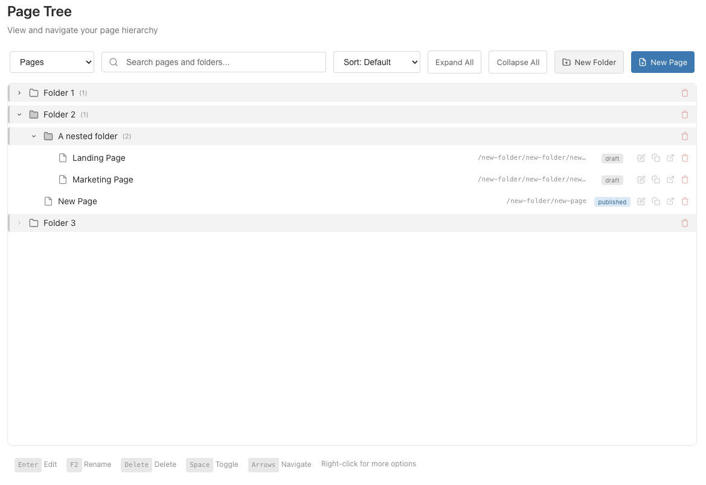
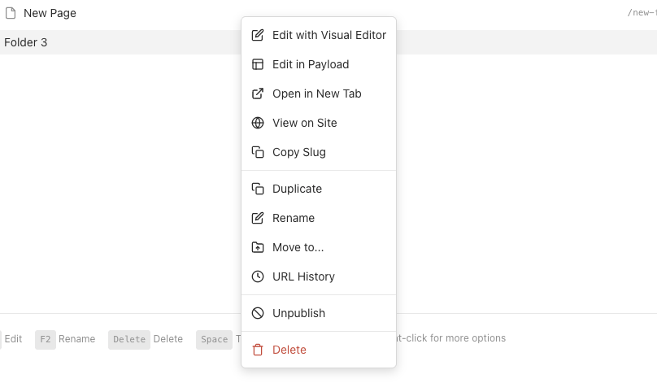
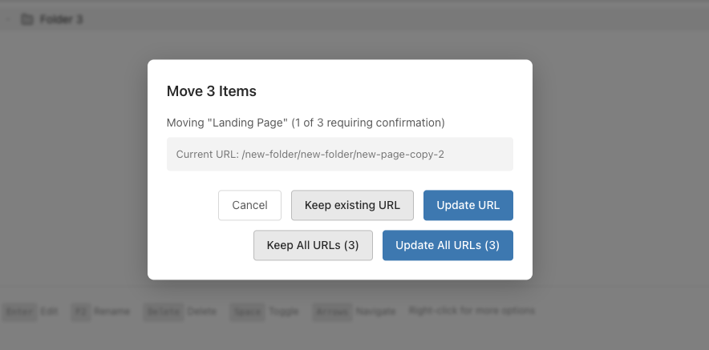

# @delmaredigital/payload-page-tree

A Payload CMS plugin that extends the built-in folders feature to auto-generate hierarchical URL slugs. Folders define URL structure, pages pick a folder, and slugs are auto-generated.

## Features

- **Minimal config** - works with `pages` and `posts` collections by default (auto-detects what exists)
- **Visual tree view** - drag-and-drop reorganization in admin panel
- **Auto-generated slugs** - hierarchical URLs from folder paths (e.g., `/appeals/2024/spring-campaign`)
- **URL history tracking** - automatic audit trail of previous URLs with restore capability
- **URL preservation** - choose to keep or update URLs when moving content
- **Collection switching** - dropdown to filter by collection type (when multiple configured)
- **Native folders** - extends Payload's built-in folders feature
- **No dummy pages** - folders are purely organizational
- **Plugin friendly** - works alongside Puck, SEO, and other plugins

## Preview

<p align="center">
  
</p>

<details>
<summary>More screenshots</summary>

### Context Menu


### Move to Modal


### Bulk Move Confirmation


</details>

## Installation

```bash
pnpm add @delmaredigital/payload-page-tree
```

## Usage

```typescript
// src/payload.config.ts
import { buildConfig } from 'payload'
import { pageTreePlugin } from '@delmaredigital/payload-page-tree'
import { Pages } from './collections/Pages'

export default buildConfig({
  collections: [Pages],
  plugins: [
    pageTreePlugin(),  // Auto-detects 'pages' and 'posts' if they exist
  ],
})
```

### Collection Requirements

Your collections **must** have a `slug` field defined. The plugin will:
- Make it read-only in the admin UI
- Auto-generate values from folder path + page segment
- Add `folder`, `pageSegment`, `sortOrder`, and `slugHistory` fields automatically

```typescript
// src/collections/Pages/index.ts
import type { CollectionConfig } from 'payload'

export const Pages: CollectionConfig = {
  slug: 'pages',
  fields: [
    { name: 'title', type: 'text', required: true },
    // ✅ Define a plain slug field - the plugin will manage it
    {
      name: 'slug',
      type: 'text',
      required: true,
      unique: true,
      index: true,
    },
    // ... other fields
  ],
}
```

> **⚠️ Important:** Do NOT use Payload's `slugField()` helper function. Use a plain text field instead. The `slugField()` helper adds its own hooks that conflict with the plugin's auto-generation.

> **Note:** Pages created from the tree view are created as drafts with minimal fields (`title`, `folder`, `sortOrder`). Required field validation is skipped for drafts, so pages with required content fields (like `blocks` or `layout`) will be created successfully and can be completed when editing.

The plugin defaults to `['pages', 'posts']` but **automatically filters to only collections that exist** in your config. If you only have a `pages` collection, `posts` is silently ignored.

### Custom Collections

```typescript
pageTreePlugin({
  collections: ['pages', 'articles', 'landing-pages'],  // Only existing ones are used
})
```

## How It Works

1. **Create folders** in the Payload admin with a `pathSegment` (e.g., "appeals", "2024")
2. **Nest folders** to create hierarchy (e.g., "2024" under "appeals")
3. **Create a page** and select a folder from the dropdown
4. **Slug auto-generates** from folder path + page segment (e.g., `appeals/2024/spring-campaign`)

### Example

```
Folders:
├── appeals (pathSegment: "appeals")
│   ├── 2024 (pathSegment: "2024")
│   └── 2025 (pathSegment: "2025")
└── services (pathSegment: "services")

Page in "2024" folder with pageSegment "spring-campaign":
→ slug: appeals/2024/spring-campaign
→ URL: /appeals/2024/spring-campaign
```

## Configuration Options

```typescript
pageTreePlugin({
  // Collections to add folder-based slugs to (default: ['pages', 'posts'])
  collections: ['pages', 'posts'],

  // Custom folder collection slug (default: 'payload-folders')
  folderSlug: 'payload-folders',

  // Field name for folder path segment (default: 'pathSegment')
  segmentFieldName: 'pathSegment',

  // Field name for page segment (default: 'pageSegment')
  pageSegmentFieldName: 'pageSegment',

  // Disable plugin hooks while preserving schema (default: false)
  disabled: false,

  // Admin view configuration
  adminView: {
    enabled: true,           // Show tree view in admin (default: true)
    path: '/page-tree',      // URL path for tree view (default: '/page-tree')
  },

  // Customize the folders collection (add access control, fields, etc.)
  customizeFolderCollection: (collection) => collection,
})
```

## Organization Scoping

For multi-tenant apps where each organization has isolated content, use `customizeFolderCollection` to add organization-based access control to folders:

```typescript
import { pageTreePlugin } from '@delmaredigital/payload-page-tree'
import { orgScopedAccess, createOrganizationField } from './access/organization'

pageTreePlugin({
  collections: ['pages'],
  customizeFolderCollection: (collection) => ({
    ...collection,
    access: orgScopedAccess,
    fields: [...collection.fields, createOrganizationField()],
  }),
})
```

This ensures:
- Folders are filtered by the user's active organization in the tree view
- New folders are automatically assigned to the user's organization
- Users can only see and manage folders belonging to their organization

> **⚠️ Migration Required:** If adding organization scoping to an existing app that already has folders, you'll need to migrate existing folder data to assign them to organizations. Unassigned folders will become inaccessible.

## Frontend Routing

Your catch-all route should query by the full slug:

```typescript
// app/[...slug]/page.tsx
export default async function Page({ params }: { params: { slug: string[] } }) {
  const fullSlug = params.slug.join('/')

  const { docs } = await payload.find({
    collection: 'pages',
    where: { slug: { equals: fullSlug } },
    limit: 1,
  })

  // ...
}
```

## Tree View

The plugin adds a visual tree view at `/admin/page-tree` for managing your page hierarchy:

- **Drag-and-drop** to reorganize pages and folders (supports multi-select)
- **Multi-select support** - Cmd/Ctrl+click to select multiple items, then drag or use "Move to..."
- **"Move to..." action** - right-click menu option to select destination folder without dragging
- **Sorting options** - sort by name, slug, or status (drag-drop disabled while sorting)
- **Collection dropdown** - switch between page types (only appears when multiple collections are configured and exist)
- **Context menu** (right-click) for actions like edit, duplicate, publish/unpublish, move, delete
- **URL preservation** - when moving folders, choose to keep existing URLs or update them
- **Bulk URL updates** - when moving multiple items, "Update All" / "Keep All" buttons for batch confirmation
- **Regenerate URLs** - manually regenerate slugs for a folder and all its contents
- **Visual distinction** - folders have subtle background styling to differentiate from pages

## Cascading Updates

When you rename a folder's `pathSegment` or move a folder:
- **Keep existing URLs**: Pages stay at their current URLs (default for moves)
- **Update URLs**: All pages in that folder (and subfolders) get new slugs based on the new path

This gives you control over URL changes - useful when you want to reorganize content without breaking existing links.

## URL History & Redirects

The plugin automatically tracks URL changes for SEO and redirect management:

### Automatic History Tracking

Every page has a `slugHistory` field that records the last 20 URL changes:

```typescript
{
  slug: 'marketing/about-us',
  slugHistory: [
    { slug: 'about-us', changedAt: '2024-01-15T...', reason: 'move' },
    { slug: 'company/about', changedAt: '2024-06-01T...', reason: 'rename' }
  ]
}
```

Changes are tracked automatically when:
- A page is moved to a different folder (reason: `move`)
- A parent folder is renamed (reason: `rename`)
- URLs are regenerated via context menu (reason: `regenerate`)
- A previous URL is restored (reason: `restore`)

### Generating Redirects

Use the redirects endpoint to build redirect maps for your frontend:

```typescript
// Fetch all redirect mappings
const res = await fetch('/api/page-tree/redirects?collection=pages')
const { redirects } = await res.json()

// Returns:
// {
//   "redirects": [
//     { "from": "/about-us", "to": "/marketing/about-us" },
//     { "from": "/company/about", "to": "/marketing/about-us" }
//   ]
// }
```

Example Next.js middleware:

```typescript
// middleware.ts
import { NextResponse } from 'next/server'

export async function middleware(request: NextRequest) {
  const res = await fetch(`${request.nextUrl.origin}/api/page-tree/redirects?collection=pages`)
  const { redirects } = await res.json()

  const redirect = redirects.find(r => r.from === request.nextUrl.pathname)
  if (redirect) {
    return NextResponse.redirect(new URL(redirect.to, request.url), 301)
  }
}
```

### Restoring Previous URLs

Right-click a page in the tree view and select "URL History" to:
- View all previous URLs with timestamps and reasons
- Restore any previous URL (current URL is added to history)

## Adding to Existing Projects

The plugin safely handles existing content:

1. **Existing pages keep their slugs** - the plugin only generates slugs for new pages or when explicitly requested
2. **No schema conflicts** - `pathSegment` is optional, so existing folders work without modification
3. **Migrate when ready** - use the "Regenerate URLs" action to update slugs for specific folders

## Extensibility

### Using Outside Payload Admin

The tree components use Payload's CSS variables for theming. When using components outside the admin panel, import the default theme:

```typescript
import '@delmaredigital/payload-page-tree/theme.css'
```

Or map to your own design system (e.g., shadcn/ui):

```css
.page-tree-wrapper {
  --theme-bg: hsl(var(--background));
  --theme-input-bg: hsl(var(--background));
  --theme-elevation-0: hsl(var(--background));
  --theme-elevation-50: hsl(var(--muted));
  --theme-elevation-100: hsl(var(--border));
  --theme-elevation-150: hsl(var(--border));
  --theme-elevation-400: hsl(var(--muted-foreground));
  --theme-elevation-500: hsl(var(--muted-foreground));
  --theme-elevation-600: hsl(var(--foreground));
  --theme-elevation-700: hsl(var(--foreground));
  --theme-elevation-800: hsl(var(--foreground));
  --theme-success-500: hsl(var(--primary));
  --theme-error-500: hsl(var(--destructive));
  --theme-error-50: hsl(var(--destructive) / 0.1);
}
```

### Custom Edit URLs

Customize where "Edit" links navigate (useful for visual editors like Puck):

```typescript
import { PageTreeClient, GetEditUrlFn } from '@delmaredigital/payload-page-tree/client'

const getEditUrl: GetEditUrlFn = (collection, id, adminRoute) => {
  // Custom URL for your visual editor
  return `${adminRoute}/my-editor/${collection}/${id}`
}

// Pass to PageTreeClient component
<PageTreeClient getEditUrl={getEditUrl} ... />
```

### Building Custom Tree Views

Use `buildTreeStructure` to create tree data for custom UIs:

```typescript
import { buildTreeStructure, TreeNode } from '@delmaredigital/payload-page-tree'

// Fetch folders and pages from Payload
const folders = await payload.find({ collection: 'payload-folders', limit: 0 })
const pages = await payload.find({ collection: 'pages', limit: 0 })

// Build tree structure
const tree: TreeNode[] = buildTreeStructure(
  folders.docs,
  pages.docs.map(p => ({ ...p, _collection: 'pages' })),
  { collections: ['pages'] }
)
```

## License

MIT
